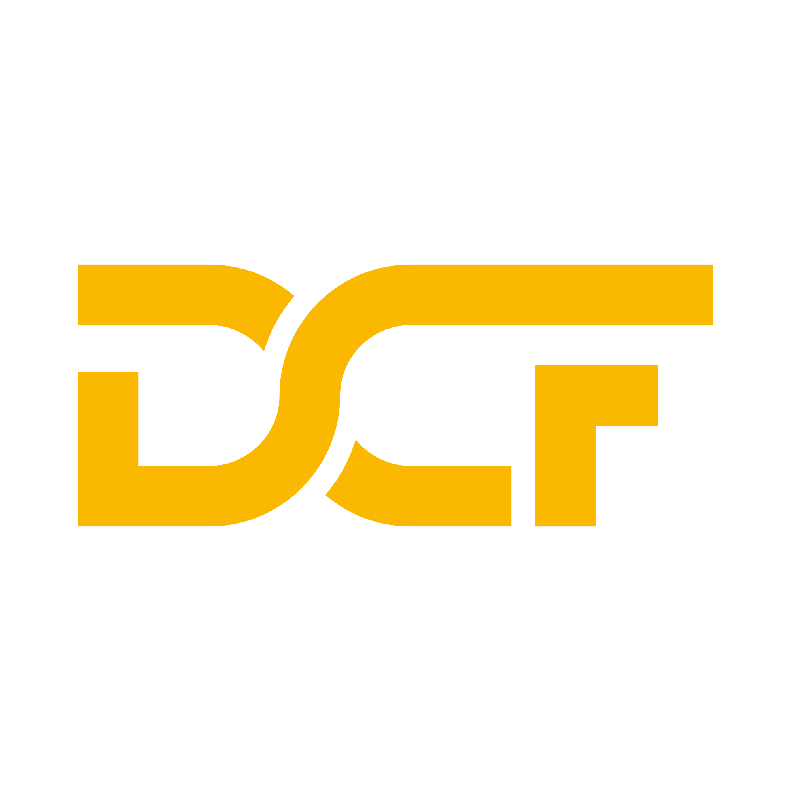

  

  

    <a href="https://dreamcodefactory.com"><strong>dreamcodefactory.com</strong></a>
    ·
    <a href="https://dreamcodefactory.com">Schedule a conversation</a>
  

---

## Who we are

Dream Code Factory is the **IT-operations partner** for small and mid-sized product teams. We take end-to-end responsibility for cloud infrastructure, Kubernetes, CI/CD, observability, and day-to-day reliability — through a predictable flat-rate model.

## What we do

We take operational ownership across the full platform lifecycle, using proven tooling and platform engineering practices to create clarity and reliability.

| Area | What we own |
| --- | --- |
| **Infrastructure** | Provisioning, networking, scaling, backup, security |
| **Kubernetes** | Cluster lifecycle, upgrades, runtime reliability, policy enforcement |
| **CI/CD** | Build and deployment pipelines for safer, repeatable releases |
| **Observability** | Metrics, logs, alerting, dashboards, visibility |
| **Security** | Hardening, access control, patching, governance |
| **Cost** | Transparent, predictable pricing aligned with business value |

## How we're different

From ownership to transparency, everything we do is structured for long-term success — not quick wins.

- **Operations-first partnership** — embedded ownership of your platform's health.
- **Full accountability** — we don't just advise, we operate.
- **Long-term scalability** — sustainable growth over quick fixes.
- **Systems & documentation** — processes and decisions are written down and shared.
- **Full transparency** — dashboards, decisions, and documentation are open by default.
- **Simplicity** — clear, maintainable solutions over unnecessary complexity.

---

  
  
<strong>Curious what value we can provide?</strong>

  
<a href="https://dreamcodefactory.com">Schedule a conversation →</a>

